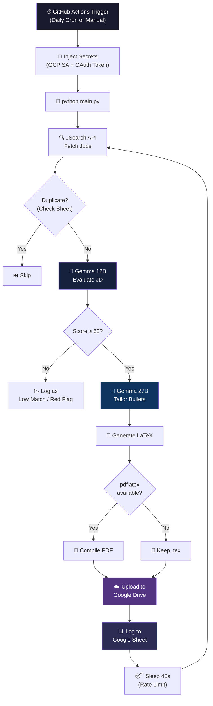
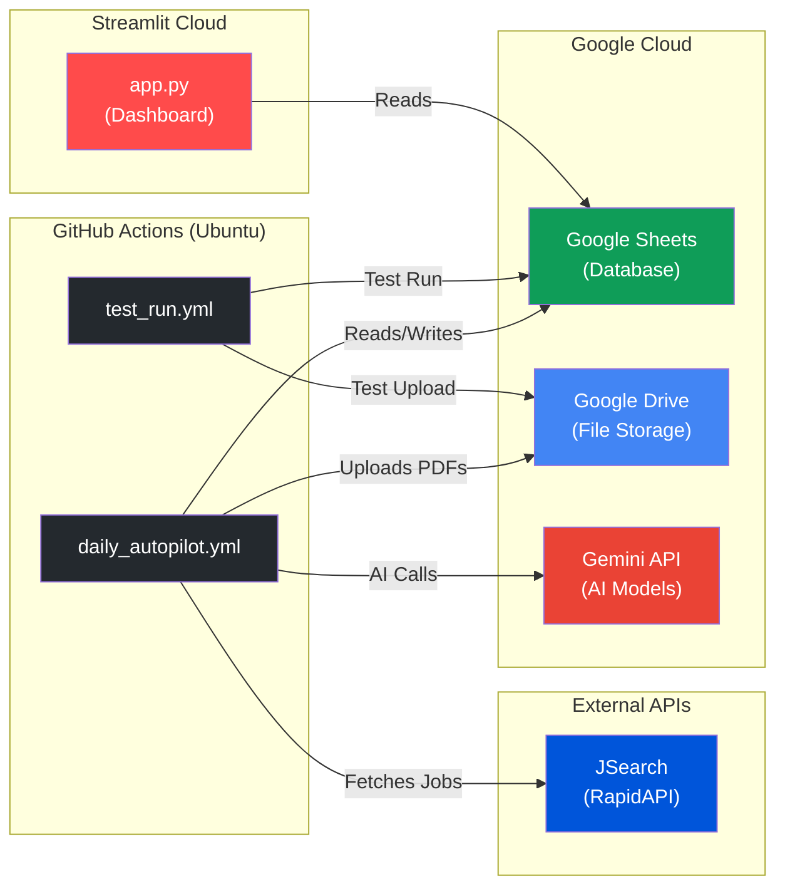

# ⚙️ AI Job Autopilot — Workflow & Architecture

## High-Level Pipeline Flow



---

## Detailed Step-by-Step

### Phase 1 — Job Discovery
| Step | Component | Action |
|------|-----------|--------|
| 1.1 | `job_fetcher.py` | Queries JSearch API with 4 search terms (Full Stack Dev + Software Dev in Vancouver + Toronto) |
| 1.2 | `job_fetcher.py` | Generates a SHA-256 hash of `(company + title + location)` as a unique job ID |
| 1.3 | `db_manager.py` | Checks Google Sheet to skip already-processed jobs |

### Phase 2 — AI Evaluation
| Step | Component | Action |
|------|-----------|--------|
| 2.1 | `job_filter.py` | Sends the full JD to **Gemma 3 12B-IT** with a structured prompt |
| 2.2 | `job_filter.py` | Parses JSON response: `{decision, match_score, evaluation_reason, extracted_pain_point}` |
| 2.3 | `main.py` | Routes: **Red Flag** → reject, **Score < 60** → skip, **Score ≥ 60** → proceed to tailoring |

### Phase 3 — Resume Tailoring
| Step | Component | Action |
|------|-----------|--------|
| 3.1 | `ai_tailor.py` | Loads `data/master_profile.json` (complete skills, experience, projects) |
| 3.2 | `ai_tailor.py` | Sends JD + profile to **Gemma 3 27B-IT** with skill-gap analysis prompt |
| 3.3 | `ai_tailor.py` | Returns 5 tailored bullet points grounded strictly in real experience |

### Phase 4 — Document Generation & Upload
| Step | Component | Action |
|------|-----------|--------|
| 4.1 | `pdf_generator.py` | Reads `templates/template.tex`, replaces `[[BULLET1]]`–`[[BULLET5]]` |
| 4.2 | `pdf_generator.py` | Escapes LaTeX special characters (`% & $ # _ { }`) in AI output |
| 4.3 | `pdf_generator.py` | Attempts `pdflatex` compilation (2 passes). Falls back to `.tex` if unavailable |
| 4.4 | `cloud_storage.py` | Creates `YYYY-MM/Company_Name/` folder hierarchy in Google Drive |
| 4.5 | `cloud_storage.py` | Uploads the generated file (PDF or TEX) and returns the Drive web link |

### Phase 5 — Logging & Review
| Step | Component | Action |
|------|-----------|--------|
| 5.1 | `db_manager.py` | Writes row to Google Sheet: job hash, company, title, score, Drive link, status |
| 5.2 | `app.py` | Streamlit dashboard reads Sheet, displays pending jobs with approve/reject buttons |
| 5.3 | `app.py` | Provides clickable Google Drive link + local `.tex` source viewer |

---

## Deployment Architecture



---

## Google Sheet Schema (11 Columns)

| Column | Description | Example |
|--------|-------------|---------|
| `Job_Hash_ID` | SHA-256 hash (first 12 chars) | `a3f8b2c1d4e5` |
| `Company` | Company name | TechNova Solutions |
| `Job_Title` | Role title | Full Stack Engineer |
| `Status` | Pipeline status | `Pending Review`, `Approved`, `Rejected - Red Flag`, `Low Match`, `Rejected - UI` |
| `Match_Score` | AI compatibility score (0-100) | 92 |
| `Evaluation_Reason` | 12B model's reasoning | "Strong Java/React match..." |
| `Pain_Point` | Extracted company pain point | "Real-time collaboration at scale" |
| `Email_Draft_Body` | (Legacy) Cold email draft | — |
| `PDF_Cloud_Link` | Google Drive web link to the resume | `https://drive.google.com/file/d/...` |
| `Job_Link` | Original job posting URL | `https://example.com/jobs/123` |
| `Applied_To_Email` | (Legacy) Hiring manager email | — |

---

## Google Drive Folder Structure

```
📁 Autopilot Root (DRIVE_ROOT_FOLDER_ID)
└── 📁 2026-03
    ├── 📁 TechNova Solutions
    │   └── 📄 resume_TechNova_Solutions.pdf
    ├── 📁 Acme Corp
    │   └── 📄 resume_Acme_Corp.pdf
    └── 📁 ...
```
